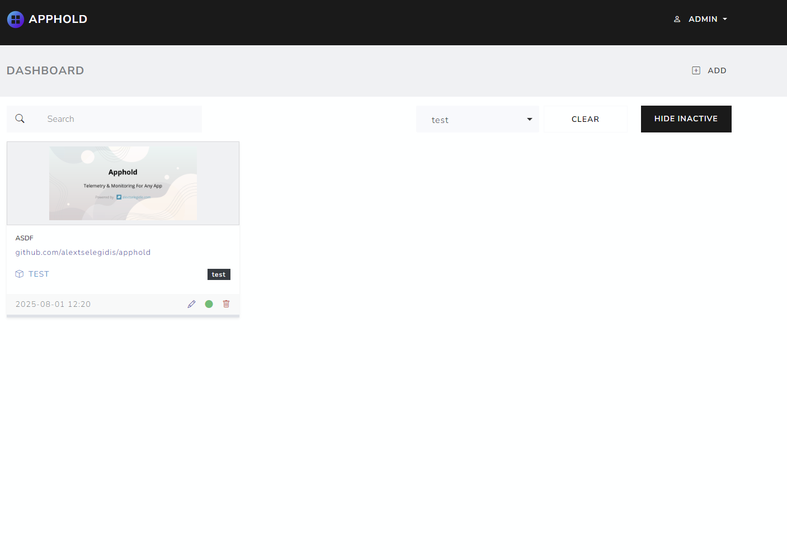

<h1 align="center">
    <br>
    <a href="https://apphold.org">
        
    </a>
    <br>
    Apphold
    <br>
</h1>

<br>

<h4 align="center">
    An Online Software Telemetry app that can be installed on your server. 
</h4>

<p align="center">
  
  
  
</p>

<p align="center">
  <a href="#about">About</a> •
  <a href="#features">Features</a> •
  <a href="#setup">Setup</a> •
  <a href="#installation">Installation</a> •
  <a href="#license">License</a>
</p>



## About

**Apphold** is an open-source software telemetry platform that monitors the uptime of your websites in real
time. Designed for developers and teams who need reliable site availability tracking, Apphold checks your
configured URLs at regular intervals and automatically detects outages.

## Features

The application will allow you to monitor your software.

## Setup

To clone and run this application, you'll need [Git](https://git-scm.com), [Node.js](https://nodejs.org/en/download/) (which comes with [npm](http://npmjs.com)) and [Composer](https://getcomposer.org) installed on your computer. From your command line:

```bash
# Clone this repository
$ git clone https://github.com/alextselegidis/apphold.git

# Go into the repository
$ cd apphold

# Install dependencies
$ npm install && composer install
```

Note: If you're using Linux Bash for Windows, [see this guide](https://www.howtogeek.com/261575/how-to-run-graphical-linux-desktop-applications-from-windows-10s-bash-shell/) or use `node` from the command prompt.

You can build the files by running `bash build.sh`. This command will bundle everything to a `build.zip` archive.

## Installation

You will need to perform the following steps to install the application on your server:

* Make sure that your server has Apache/Nginx, PHP (8.2+) and MySQL installed.
* Create a new database (or use an existing one).
* Copy the "apphold" source folder on your server.
* Make sure that the "storage" directory is writable.
* Rename the ".env.example" file to ".env" and update its contents based on your environment.
* Open the browser on the Apphold URL and follow the installation guide.

That's it! You can now use Apphold at your will.

You will find the latest release at [apphold.org](https://apphold.org).
You can also report problems on the [issues page](https://github.com/alextselegidis/apphold/issues)
and help the development progress.

## License

Code Licensed Under [GPL v3.0](https://www.gnu.org/licenses/gpl-3.0.en.html) | Content Under [CC BY 3.0](https://creativecommons.org/licenses/by/3.0/)

---

Website [alextselegidis.com](https://alextselegidis.com) &nbsp;&middot;&nbsp;
GitHub [alextselegidis](https://github.com/alextselegidis) &nbsp;&middot;&nbsp;
Twitter [@alextselegidis](https://twitter.com/AlexTselegidis)

###### More Projects On Github
###### ⇾ [Plainpad &middot; Self Hosted Note Taking App](https://github.com/alextselegidis/plainpad)
###### ⇾ [Easy!Appointments &middot; Online Appointment Scheduler](https://github.com/alextselegidis/easyappointments)
###### ⇾ [Integravy &middot; Service Orchestration At Your Fingertips](https://github.com/alextselegidis/integravy)
